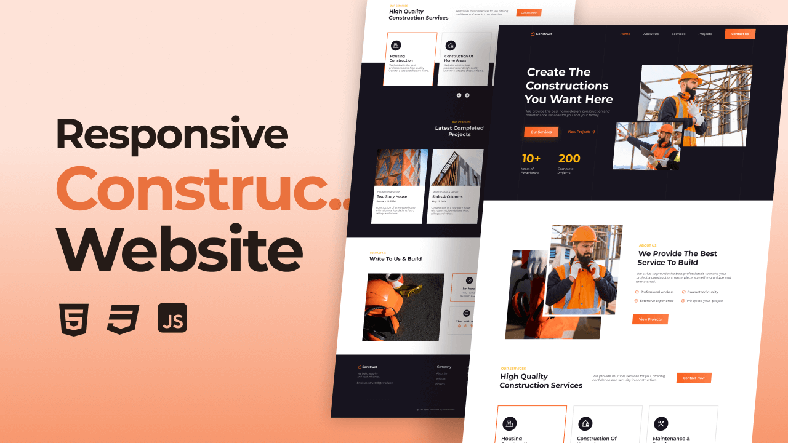

# Construction Website

Build a modern, responsive website for a construction business—showcasing projects, services, and easy client engagement.

---

##  Demo


---

##  Features
- Responsive design: fully usable across mobiles, tablets, desktops  
- Project gallery: organized showcase of work  
- Service overview: clear and concise service cards  
- Contact form: client-friendly submission with validation  
- Smooth UI interactions & fast navigation

---

##  Tech Stack
- Built with clean **HTML5**, **CSS3**, and **JavaScript** for performance  
- Optional: enhance with SCSS or a lightweight bundler like Parcel

---

##  Setup & Installation
```bash
git clone https://github.com/yourusername/your-repo.git
cd your-repo
# No dependencies required—open index.html directly or use:
npx serve
